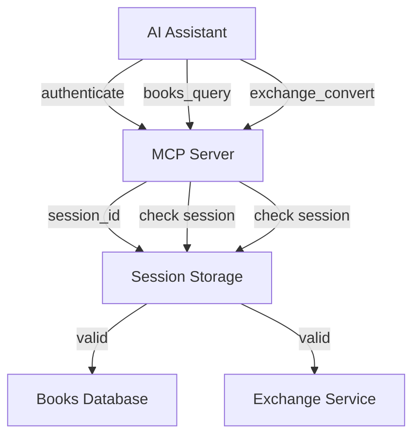

# 🔐 Session-Based Authenticated MCP Server

A **Model Context Protocol (MCP) server** with **session-based authentication** that provides secure access to books database and currency conversion tools. **Designed specifically for AI assistants** to use authentication seamlessly.


## ✨ Key Features

### 🔐 **Session-Based Authentication**
- Simple authentication with username only
- Automatic session management (1-hour expiration)
- No token parameters required in tool calls
- Perfect for AI assistant integration

### 📚 **Books Database**
- Search books by title, author, genre, year
- Paginated results with limit/offset
- Individual book lookup by ID
- CSV-based storage with Excel conversion

### 💱 **Currency Exchange**
- Convert between 10+ major currencies
- Real-time synthetic exchange rates
- Precise decimal calculations
- Error handling for invalid currencies

### 🤖 **AI Assistant Optimized**
- Seamless integration with GitHub Copilot, Claude Desktop, Cursor IDE
- No complex token passing required
- Simple authenticate-then-use workflow
- Comprehensive error messages and hints

## 🚀 Quick Start

### 1. Installation

```bash
# Clone the repository
git clone https://github.com/omiderfanmanesh/MCP-server.git
cd MCP-server

# Install dependencies
pip install -r requirements.txt
```

### 2. Run the Server

```bash
# Start the MCP server
python -m mcp_server.server
```

### 3. Basic Usage

```bash
# First, authenticate
"Please authenticate me as 'developer'"

# Then use any protected tools
"Find me some science fiction books"
"Convert 100 USD to EUR"
"Check my session status"
"Log me out when done"
```

## 🔧 Integration Examples

### Cursor IDE Configuration

Add to your MCP settings:

```json
{
  "mcpServers": {
    "authenticated-books": {
      "command": "python",
      "args": ["-m", "mcp_server.server"],
      "cwd": "/path/to/MCP-server"
    }
  }
}
```

### Claude Desktop Configuration

```json
{
  "mcpServers": {
    "authenticated-books": {
      "command": "python",
      "args": ["-m", "mcp_server.server"],
      "cwd": "/path/to/MCP-server"
    }
  }
}
```

## 📋 Available Tools

| Tool | Description | Authentication Required |
|------|-------------|------------------------|
| `authenticate` | Create new user session | ❌ No |
| `session_status` | Check current session info | ❌ No |
| `logout` | End current session | ❌ No |
| `books_query` | Search books database | ✅ Yes |
| `exchange_convert` | Convert currencies | ✅ Yes |

## 🧪 Testing

This project includes a comprehensive test suite with 30 test cases covering all functionality:

```bash
# Run all tests
python -m pytest tests/ -v

# Run specific test categories
python -m pytest tests/test_mcp_server.py::TestSessionAuthentication -v
python -m pytest tests/test_mcp_server.py::TestBooksRepository -v
python -m pytest tests/test_mcp_server.py::TestExchangeRates -v
```

### Test Coverage

- ✅ JWT token generation and validation
- ✅ Session authentication flow
- ✅ Protected operations security
- ✅ Books database queries and filtering
- ✅ Currency conversion with all supported currencies
- ✅ Error handling and edge cases
- ✅ Integration workflows
- ✅ Session expiration and cleanup

## 🐳 Docker Deployment

### Local Development

```bash
# Build and run with Docker Compose
docker-compose up --build

# The server will be available on localhost:8000
```

### Production Deployment

```bash
# Build production image
docker build -t mcp-auth-server .

# Run container
docker run -p 8000:8000 mcp-auth-server
```

## 📚 Documentation

| Document | Description |
|----------|-------------|
| [📖 Getting Started](docs/GETTING_STARTED.md) | Complete setup and usage guide |
| [🏗️ Architecture](docs/ARCHITECTURE.md) | System design and data flow diagrams |
| [📡 API Reference](docs/API.md) | Complete tool documentation |
| [🚀 Deployment](docs/DEPLOYMENT.md) | Production deployment guide |
| [💡 Examples](docs/EXAMPLES.md) | Real-world usage scenarios |

## 🏗️ Architecture Overview



### Core Components

- **Session Manager**: Handles authentication and session lifecycle
- **Books Repository**: CSV-based database with search capabilities
- **Exchange Service**: Multi-currency conversion with synthetic rates
- **Security Layer**: JWT-based session validation
- **Error Handler**: Comprehensive error messages and recovery hints

## 🔄 Authentication Flow

1. **Authenticate**: `authenticate(username="your_name")`
   - Generates JWT token
   - Creates session with 1-hour expiration
   - Returns session details

2. **Use Tools**: Call any protected operation
   - Automatic session validation
   - No token parameters needed
   - Clear error messages if session expired

3. **Logout**: `logout()`
   - Cleans up session data
   - Clears authentication state

## 🌟 Why Session-Based?

Unlike traditional JWT implementations that require token parameters in every API call, this server uses **session-based authentication** specifically designed for AI assistants:

### Problems with Token Parameters
- AI assistants can't easily pass tokens to tool calls
- Complex parameter management
- Poor user experience

### Session-Based Solution
- ✅ Authenticate once, use forever (until expiration)
- ✅ No token parameters in tool schemas
- ✅ Perfect for AI assistant workflows
- ✅ Automatic session management

## 🛠️ Development

### Project Structure

```
MCP-server/
├── mcp_server/           # Main server code
│   ├── server.py         # MCP server with authentication
│   ├── books.py          # Books database repository
│   └── exchange.py       # Currency exchange service
├── tests/                # Comprehensive test suite
│   └── test_mcp_server.py
├── docs/                 # Complete documentation
│   ├── ARCHITECTURE.md   # System design
│   ├── API.md           # Tool reference
│   ├── DEPLOYMENT.md    # Production guide
│   ├── EXAMPLES.md      # Usage scenarios
│   └── GETTING_STARTED.md
├── data/                 # Books database
│   └── books.csv
├── docker-compose.yml    # Docker deployment
├── Dockerfile           # Container definition
└── requirements.txt     # Dependencies
```

### Development Setup

```bash
# Install in development mode
pip install -e .

# Run tests with coverage
python -m pytest tests/ --cov=mcp_server

# Run server with debug logging
python -m mcp_server.server --debug
```

## 📄 License

This project is licensed under the MIT License - see the [LICENSE](LICENSE) file for details.

## 🤝 Contributing

1. Fork the repository
2. Create a feature branch (`git checkout -b feature/amazing-feature`)
3. Commit your changes (`git commit -m 'Add amazing feature'`)
4. Push to the branch (`git push origin feature/amazing-feature`)
5. Open a Pull Request

See [CONTRIBUTING.md](CONTRIBUTING.md) for detailed guidelines.

## 🔗 Links

- [Model Context Protocol Specification](https://modelcontextprotocol.io/)
- [MCP Python SDK](https://github.com/modelcontextprotocol/python-sdk)
- [Claude Desktop Integration](https://claude.ai/desktop)
- [Cursor IDE](https://cursor.sh/)

## 📞 Support

- 📧 Email: [Your Email]
- 🐛 Issues: [GitHub Issues](https://github.com/omiderfanmanesh/MCP-server/issues)
- 📖 Docs: [Documentation](docs/)
- 💬 Discussions: [GitHub Discussions](https://github.com/omiderfanmanesh/MCP-server/discussions)

---

**Ready to authenticate your MCP server?** 🚀 Start with the [Getting Started Guide](docs/GETTING_STARTED.md)!