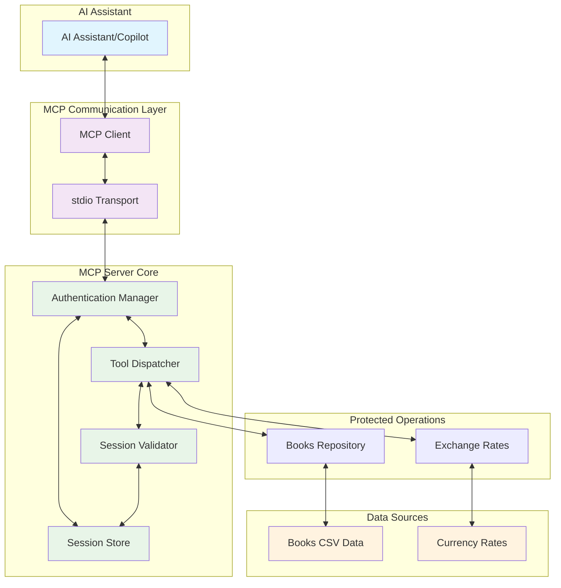
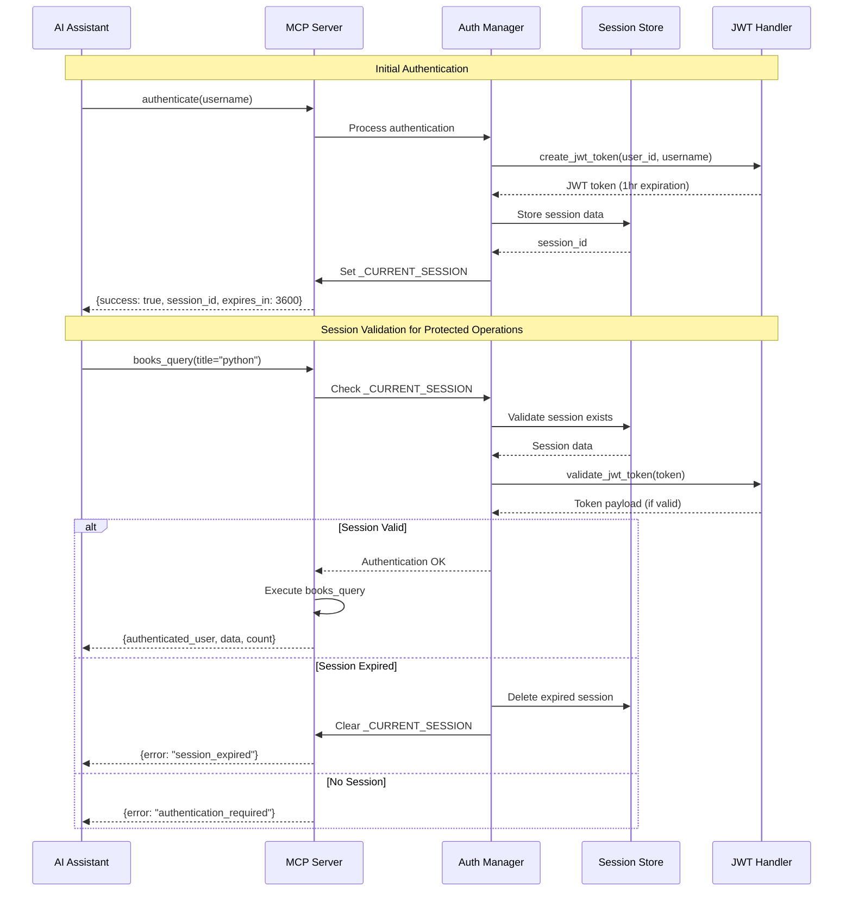
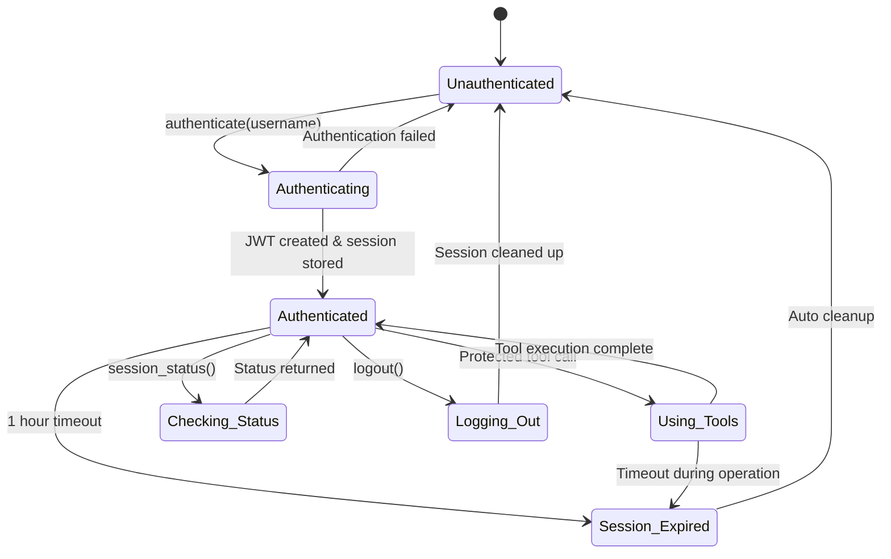
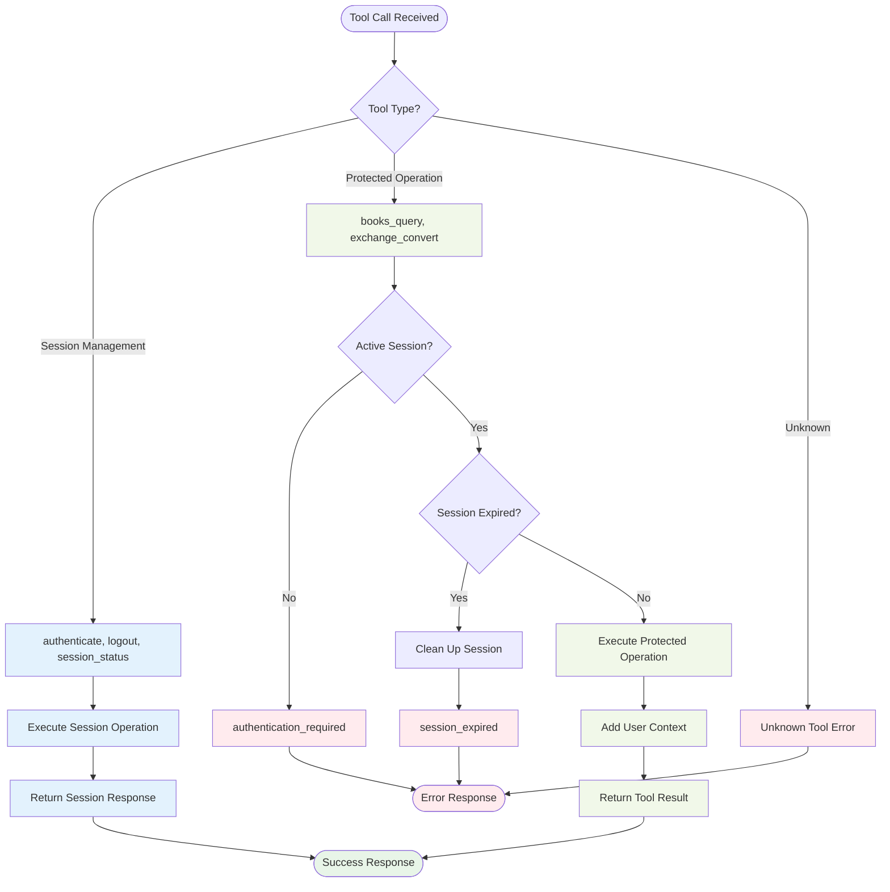
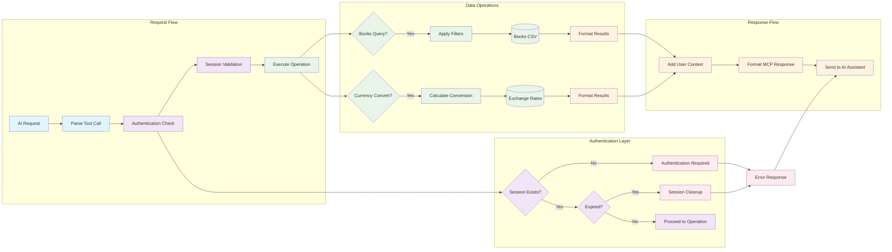
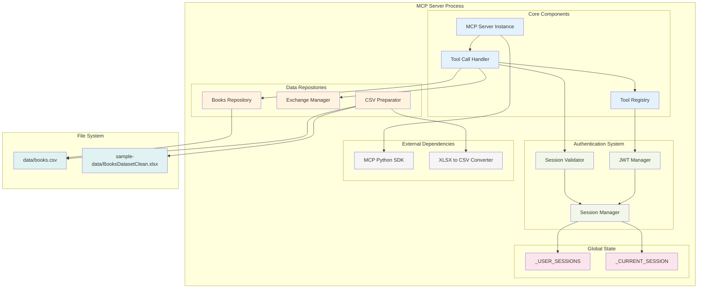
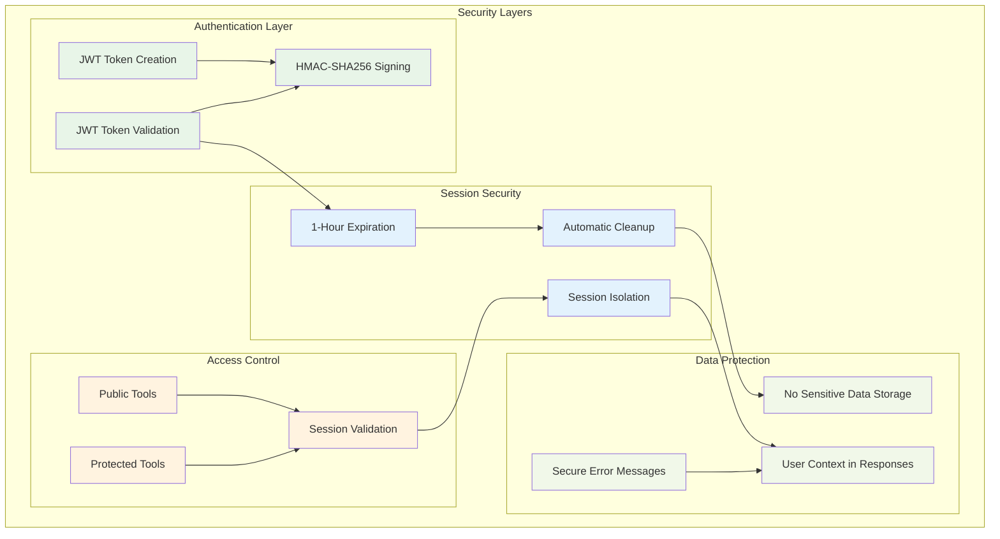
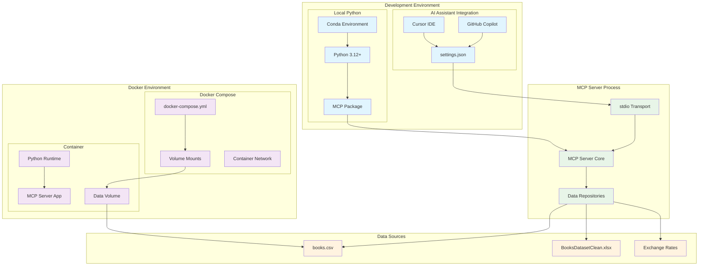

# Session-Based Authenticated MCP Server Architecture

This document provides comprehensive architectural diagrams and technical details for the Session-Based Authenticated Model Context Protocol (MCP) Server.

## Table of Contents

1. [System Overview](#system-overview)
2. [Authentication Flow](#authentication-flow)
3. [Session Management](#session-management)
4. [Tool Call Processing](#tool-call-processing)
5. [Data Flow Architecture](#data-flow-architecture)
6. [Component Relationships](#component-relationships)
7. [Security Model](#security-model)
8. [Deployment Architecture](#deployment-architecture)

---

## System Overview

The MCP Server implements a session-based authentication system specifically designed for AI assistants and automated tools. The architecture addresses the limitation where AI assistants cannot pass authentication tokens as parameters to individual tool calls.



### Key Architecture Principles

- **Session-Based Authentication**: Global session state eliminates need for token parameters
- **AI Assistant Compatibility**: Designed specifically for AI tool usage patterns
- **Stateful Server Design**: Maintains session context across multiple tool calls
- **Security Through Expiration**: 1-hour session limits with automatic cleanup
- **Modular Component Design**: Separated concerns for authentication, data, and operations

---

## Authentication Flow

The authentication system uses JWT tokens for session management with a global session store for AI assistant compatibility.



### Authentication Components

1. **JWT Handler**: Creates and validates HS256-signed tokens with 1-hour expiration
2. **Session Store**: Global dictionary storing active sessions with metadata
3. **Current Session Tracker**: `_CURRENT_SESSION` global variable for active session
4. **Automatic Cleanup**: Expired sessions removed on next access attempt

---

## Session Management

The session management system maintains global state to enable seamless AI assistant interactions.



### Session Data Structure

```json
{
  "session_id": {
    "username": "alice",
    "user_id": "user_1234",
    "token": "eyJ0eXAiOiJKV1QiLCJhbGciOiJIUzI1NiJ9...",
    "created_at": 1640995200.0
  }
}
```

### Global Variables

- **`_USER_SESSIONS`**: Dictionary storing all active sessions
- **`_CURRENT_SESSION`**: String ID of currently active session
- **Session Expiration**: 3600 seconds (1 hour) from creation

---

## Tool Call Processing

The tool dispatcher handles both public and protected operations with session validation.



### Tool Categories

1. **Session Management Tools** (Public Access):
   - `authenticate`: Create new session
   - `session_status`: Check authentication state
   - `logout`: End current session

2. **Protected Operations** (Require Authentication):
   - `books_query`: Search book database
   - `exchange_convert`: Currency conversion

### Response Format

All responses include user context for audit trails:

```json
{
  "authenticated_user": "alice",
  "data": {...},
  "timestamp": 1640995200.0
}
```

---

## Data Flow Architecture

The data flow shows how information moves through the system from AI assistant requests to data sources.



### Data Sources

1. **Books Database**: CSV file converted from Excel with book metadata
2. **Exchange Rates**: Synthetic currency conversion rates for demo purposes
3. **Session Storage**: In-memory dictionary (Redis/DB in production)

---

## Component Relationships

The component diagram shows the internal structure and dependencies within the MCP server.



### Component Dependencies

1. **MCP Server Instance**: Central coordinator using Python MCP SDK
2. **Tool Call Handler**: Main dispatcher for all incoming requests
3. **Session Manager**: Handles authentication state and validation
4. **Data Repositories**: Encapsulate book and currency data operations
5. **Global State**: Shared session storage for AI assistant compatibility

---

## Security Model

The security architecture balances simplicity with protection for demonstration purposes.



### Security Features

1. **JWT Token Security**:
   - HS256 algorithm with HMAC-SHA256 signing
   - 1-hour expiration for session limits
   - Demo secret key (replace in production)

2. **Session Management**:
   - Automatic cleanup of expired sessions
   - Session isolation between users
   - No persistent storage of sensitive data

3. **Access Control**:
   - Public tools (session management) vs protected tools (data operations)
   - Session validation for all protected operations
   - Clear authentication error messages

4. **Audit Trail**:
   - All responses include authenticated_user context
   - Operation timestamps for tracking
   - Comprehensive error reporting

### Security Considerations for Production

- Replace demo secret key with secure random key from environment
- Implement Redis or database for session storage
- Add rate limiting and request validation
- Use HTTPS for transport security
- Implement proper logging and monitoring

---

## Deployment Architecture

The deployment architecture shows how the MCP server integrates with different environments and clients.



### Deployment Options

1. **Local Development**:
   ```bash
   # Direct execution
   python -m mcp_server.server
   
   # Via Cursor IDE integration
   # Configured in settings.json
   ```

2. **Docker Deployment**:
   ```bash
   # Docker Compose
   docker-compose up
   
   # Direct Docker
   docker build -t mcp-server .
   docker run -v $(pwd)/data:/app/data mcp-server
   ```

3. **AI Assistant Integration**:
   ```json
   {
     "mcpServers": {
       "books-mcp": {
         "command": "python",
         "args": ["-m", "mcp_server.server"],
         "cwd": "/path/to/project"
       }
     }
   }
   ```

### Integration Points

- **Cursor IDE**: Direct integration via settings.json configuration
- **GitHub Copilot**: MCP client connection for AI assistant features
- **Docker**: Containerized deployment with volume mounts for data
- **Local Development**: Direct Python execution with conda environment

---

## Conclusion

This architecture provides a robust, session-based authentication system specifically designed for AI assistant compatibility. The design balances security, usability, and simplicity while maintaining clear separation of concerns and comprehensive audit trails.

Key architectural decisions:
- Global session state for AI assistant compatibility
- JWT tokens for secure session management
- 1-hour session expiration for security
- Comprehensive error handling and user feedback
- Modular component design for maintainability
- Docker support for deployment flexibility

The system successfully addresses the core challenge of providing authenticated access to protected operations while maintaining a simple, intuitive workflow for AI assistants.